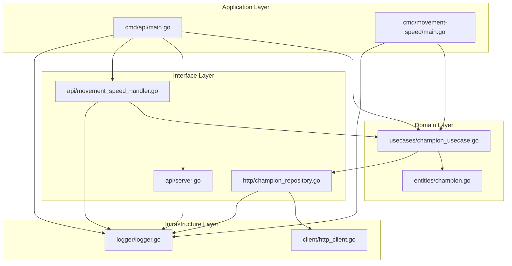
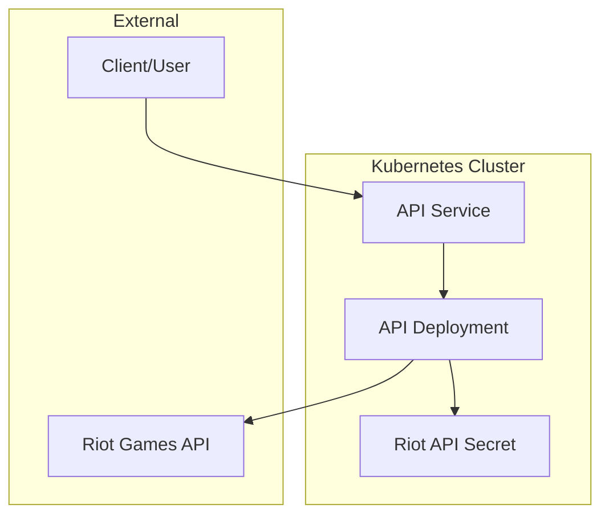
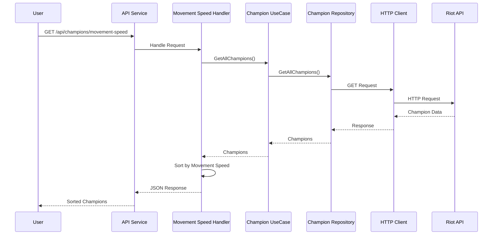

# POC_DEVIN Architecture Diagram

This document provides a visual representation of the POC_DEVIN project architecture, showing the relationships between components and the flow of data through the system.

## Clean Architecture Overview

The project follows clean architecture principles with distinct layers:

## Kubernetes Deployment Architecture

The application is deployed to Kubernetes with the following components:

## Data Flow

The following diagram illustrates the flow of data through the system:

## Component Descriptions

### Application Layer
- **cmd/api/main.go**: REST API entry point that initializes components and serves HTTP endpoints
- **cmd/movement-speed/main.go**: CLI application that displays champions sorted by movement speed

### Domain Layer
- **entities/champion.go**: Data structures representing League of Legends champions
- **usecases/champion_usecase.go**: Business logic for retrieving and processing champion data

### Interface Layer
- **http/champion_repository.go**: Adapter for retrieving champion data from Riot API
- **api/movement_speed_handler.go**: HTTP handler for the movement speed endpoint
- **api/server.go**: HTTP server implementation with graceful shutdown

### Infrastructure Layer
- **client/http_client.go**: HTTP client implementation for external API requests
- **logger/logger.go**: Logging functionality with different severity levels

### Kubernetes Components
- **kubernetes/api-deployment.yaml**: Deployment configuration for the API
- **kubernetes/api-service.yaml**: Service configuration to expose the API
- **kubernetes/riot-api-secret.yaml**: Secret for storing the Riot API key
