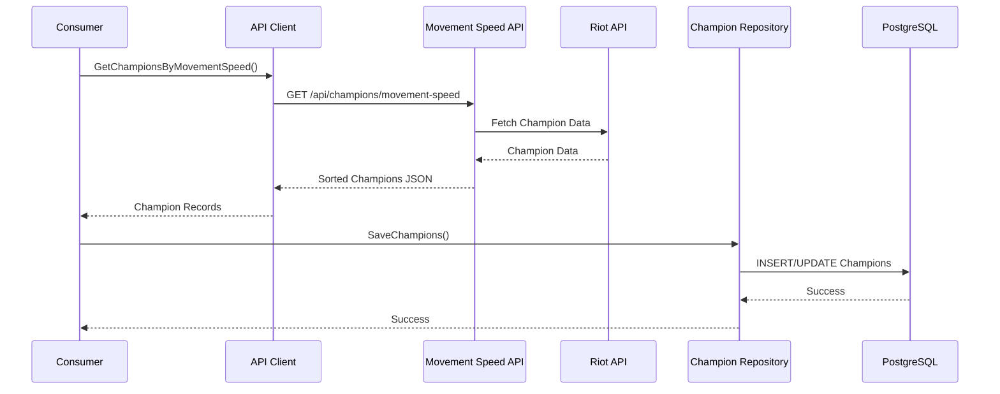
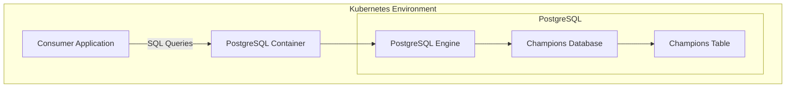

# Consumer Application with PostgreSQL Architecture

This document provides a visual representation of the consumer application architecture with PostgreSQL integration, showing the relationships between components and the flow of data through the system.

## Multi-Cluster Architecture Overview

The project uses two Kubernetes clusters with the following components:

## Clean Architecture Overview

The consumer application follows clean architecture principles with distinct layers:

## Data Flow

The following diagram illustrates the flow of data through the system:

## PostgreSQL Database Integration

The following diagram shows the PostgreSQL database integration for the consumer application:

## Component Descriptions

### Application Layer
- **cmd/consumer/main.go**: Entry point that initializes components and runs the synchronization process

### Domain Layer
- **entities/champion_record.go**: Data structures representing champion records in the database
- **repositories/champion_repository.go**: Interface for database operations

### Interface Layer
- **api/movement_speed_client.go**: Client for retrieving champion data from the movement speed API
- **db/postgres_champion_repository.go**: PostgreSQL implementation of the champion repository

### Infrastructure Layer
- **client/http_client.go**: HTTP client implementation for API requests
- **db/postgres.go**: PostgreSQL connection and initialization
- **logger/logger.go**: Logging functionality with different severity levels

### Kubernetes Components
- **kubernetes/consumer/deployment.yaml**: Deployment configuration for the consumer application
- **kubernetes/consumer/postgres.yaml**: Deployment and service configuration for PostgreSQL
